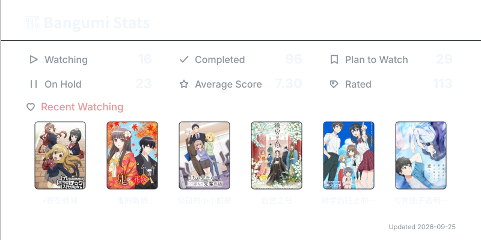

## Hi👋, I'm SiIverAsh

I am a Master’s student majoring in Software Engineering. I am deeply passionate about AI, networking, software development, reverse engineering, game development, and embedded systems. I am currently dedicated to exploring these fields and expanding my technical toolkit.

<h2>Languages</h2>

  
  

## ⏱️ Development Activity

  

## 🌸 Anime

  
  

## 🎵 Music

  
  

## 💻 Working environment

## 😀 My favorite things

